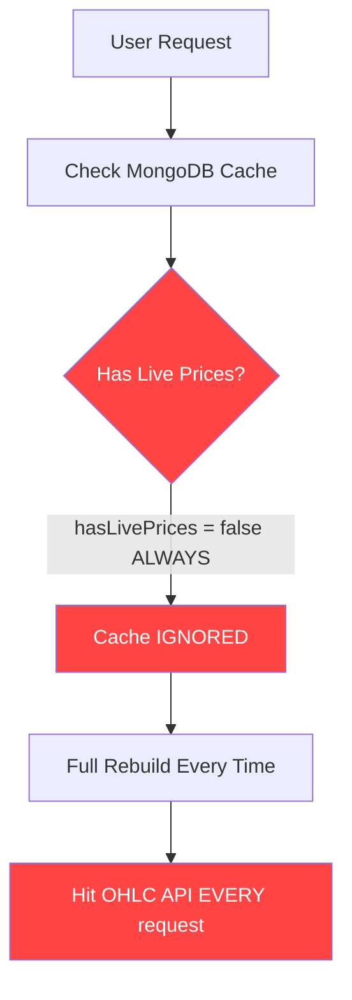
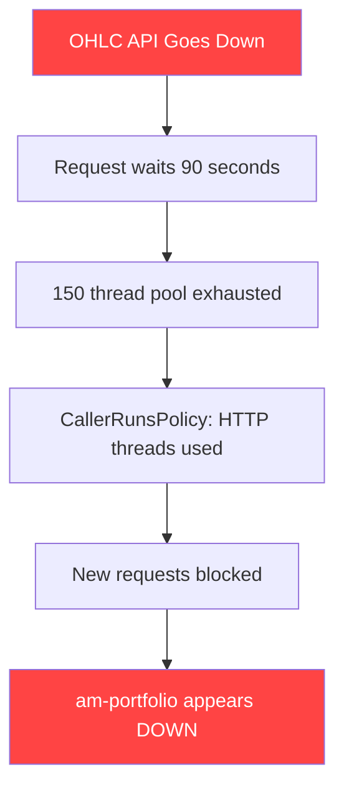

# am-portfolio — Production Readiness Report
> Analysed: 2026-07-28 | Branch: hotfix/portfolio-advanced-endpoint

---

## Overall Rating: **7.1 / 10**

> This is a sophisticated, well-architected portfolio backend for an early-stage fintech product.
> It is well above a "side-project" and shows strong engineering maturity in several areas.
> However, several specific gaps must be closed before it is safe to call it **fully production-grade**.

---

## Score Breakdown

| Category | Score | Notes |
|---|---|---|
| Architecture & Modularity | 9/10 | Excellent modular Maven structure |
| Observability | 8/10 | Strong, but tracing sampling at 100% |
| Data Layer & Caching | 7/10 | Working but Redis is disabled |
| Real-time Data (Kafka) | 6/10 | 2 known bugs still open |
| Security | 6/10 | Gateway-level only, no DEV endpoint guard |
| Resilience & Fault Tolerance | 5/10 | No circuit breakers, no retry policy |
| Testing Coverage | 5/10 | Integration tests present, unit tests sparse |
| API Design | 8/10 | Clean REST, OpenAPI docs, good error handling |
| Performance & Concurrency | 8/10 | Excellent async design with CompletableFuture |
| Code Quality & Debt | 7/10 | Good, but has critical `hasLivePrices = false` bug |

---

## What You Have That Is Industry-Standard ✅

### 1. Excellent Multi-Module Architecture
```
am-portfolio
├── portfolio-api           → Controllers, Security, OpenAPI
├── portfolio-service       → Business logic, Schedulers
├── portfolio-analytics     → Advanced analytics providers (pluggable)
├── portfolio-market-data   → Market data waterfall (Mongo → API)
├── portfolio-kafka         → All Kafka consumers
├── portfolio-redis         → Redis caching layer
├── portfolio-model         → Shared models, DTOs
├── am-common-data          → Persistence layer (MongoDB Documents)
└── portfolio-basket        → Basket holdings (separate concern)
```
This is exactly how a fintech backend should be structured — each module has a single responsibility. This is what you see at Zerodha, Groww, and Smallcase.

### 2. 3-Tier Market Data Waterfall
```
Request comes in
     │
     ▼
[1] Redis Cache  ──── DISABLED (TODO in code) ────┐
     │                                              │
     ▼ (miss)                                      │
[2] MongoDB Cache ──── Kafka writes here live       │
     │                                              │
     ▼ (miss)                                       │
[3] Upstox OHLC API ─ In-flight deduplication      │
     │                 (prevents cache stampedes) ◄─┘
     ▼
  Response
```
This pattern is industry-standard and very well implemented. The in-flight deduplication (`ConcurrentHashMap<String, CompletableFuture<MarketData>>`) is a professional technique that prevents thundering herd problems.

### 3. Distributed Tracing & Observability
- W3C `traceparent` header propagation across services
- MDC propagation across async thread boundaries (`MdcTaskDecorator`)
- Micrometer metrics with custom business gauges (`portfolio.users.total`, `portfolio.portfolios.total`)
- Prometheus-ready with defined SLO buckets: `100ms, 500ms, 1s, 5s, 10s, 20s, 30s`
- OTEL collector exporter for Tempo/Jaeger
- `@Observed` annotations on key service methods

### 4. Async & Performance Design
- Dual thread pools: `taskExecutor` (50 core, 100 max) and `externalApiExecutor` (50 core, 150 max)
- CallerRunsPolicy for backpressure instead of queue overflow rejection
- Parallel chunk fetching for OHLC API (20 symbols per chunk, all chunks in parallel)
- `CompletableFuture.allOf()` for fan-out/fan-in pattern
- Fire-and-forget MongoDB writes after API fetch (response not blocked)

### 5. End-of-Day Snapshot Scheduler
- Runs at 17:00 IST for all active users
- Stores per-portfolio OHLC-style snapshots (`open, high, low, close`)
- Supports historical chart queries by timeframe

### 6. Kafka Consumer Design
- Manual `Acknowledgment` (no auto-commit)
- De-duplication via Redis keys with 24h TTL
- Handles two separate event shapes (`PortfolioUpdateEvent` + `TradePortfolioSyncEvent`) from the same topic
- `nack` with 5-second backoff on failure (not silent discard)

### 7. Security (Partially)
- JWT-based authentication via Spring Security OAuth2 Resource Server
- `UserContext.getUserIdOrThrow()` called on EVERY endpoint — no accidental data leaks between users
- Gateway-enforced auth at Traefik/edge level
- Stateless sessions (no JSESSIONID)
- Docker HEALTHCHECK configured

---

## Production Gaps ❌ (Critical Issues)

### Gap 1: The MongoDB Cache is Always Bypassed (CRITICAL BUG)

**File:** [`PortfolioHoldingsService.java:264-272`](file://C:/Users/Md Sahimuzzaman/Desktop/axrax-v1/am-portfolio/portfolio-service/src/main/java/com/portfolio/service/portfolio/PortfolioHoldingsService.java#L264-L272)

```java
// THIS IS THE BUG - hasLivePrices is hardcoded to false
// The entire MongoDB cache layer is DEAD CODE
boolean hasLivePrices = false;  // ← BUG: Should check actual holdings

if (hasLivePrices) {
    return cachedHoldings;  // This NEVER executes
}
log.warn("MongoDB holdings cache has stale/zero prices...");
// Always rebuilds from scratch = ALWAYS calls the OHLC API
```

**Impact:** Every single request from every user rebuilds the full portfolio from MongoDB → OHLC API. The 15-minute MongoDB cache that was built is **completely ignored**. This is why the UI is slow and the OHLC API gets hammered.



---

### Gap 2: The Kafka ₹0.00 Price Bug (KNOWN, UNFIXED)

**File:** [`MarketDataService.java:454-495`](file://C:/Users/Md Sahimuzzaman/Desktop/axrax-v1/am-portfolio/portfolio-market-data/src/main/java/com/portfolio/marketdata/service/MarketDataService.java#L454-L495)

Inactive stocks (e.g., `AARTIIND`) have only `lastPrice: 0` in the Kafka MongoDB cache with no `previousClose` or `openPrice`. The current code accepts this entry and returns `₹0.00` to the UI instead of falling back to the Upstox API.

```mermaid
flowchart TD
    A[AARTIIND Request] --> B[MongoDB Cache]
    B --> C[{lastPrice: 0, previousClose: null, openPrice: null}]
    C --> D[Accepted as valid!]
    D --> E[Returns ₹0.00 to UI]
    style C fill:#ff4444,color:#fff
    style D fill:#ff4444,color:#fff
    style E fill:#ff4444,color:#fff
```

---

### Gap 3: Redis is Disabled Everywhere (Performance Risk)

**Files:** `PortfolioHoldingsService.java`, `MarketDataService.java`

Both Redis cache layers have been commented out with `// TODO: Re-enable when Redis is back online`. This means:
- Every market data request goes to MongoDB → OHLC API
- Every holdings request triggers a full re-enrich cycle
- At 100 concurrent users, this will significantly degrade response time

---

### Gap 4: DEV Admin Endpoints Have No Access Control (Security Risk)

**File:** [`PortfolioController.java:313-342`](file://C:/Users/Md Sahimuzzaman/Desktop/axrax-v1/am-portfolio/portfolio-api/src/main/java/com/portfolio/api/PortfolioController.java#L313-L342)

```java
@Hidden        // Hidden from Swagger, but still accessible!
@PostMapping("/dev/trigger-catchup")   // Any authenticated user can call this
@PostMapping("/dev/migrate-groww")     // Performs bulk DB writes!
```

These endpoints run expensive batch jobs and perform bulk MongoDB writes. Any logged-in user can trigger them by guessing the URL. They need `@PreAuthorize("hasRole('ADMIN')")` or to be disabled in production via `@ConditionalOnProperty`.

---

### Gap 5: No Circuit Breaker on External API Calls (Resilience Risk)

The `resilience4j` library is a **dependency** in `portfolio-market-data/pom.xml` but is **never used** with `@CircuitBreaker`, `@Retry`, or `@TimeLimiter` annotations anywhere in the code.

If the `am-market-data` OHLC API goes down:
- All requests wait the full 90-second timeout
- The `externalApiExecutor` thread pool fills up
- Requests start queueing → CallerRunsPolicy → HTTP threads blocked → Service appears down



**The fix:** Wrap `getOhlcData()` with `@CircuitBreaker` from Resilience4j — already in pom.xml, just not wired up.

---

### Gap 6: Duplicate Portfolio Bug in `getPortfoliosByUserId`

**File:** [`PortfolioServiceImpl.java:27-32`](file://C:/Users/Md Sahimuzzaman/Desktop/axrax-v1/am-portfolio/am-common-data/am-common-data-service/src/main/java/com/am/common/amcommondata/service/PortfolioServiceImpl.java#L27-L32)

`getPortfoliosByUserId` returns **all** portfolio documents for a user from MongoDB with no deduplication. If a user has `Groww`, `Groww-V1`, `Groww-V2` in the database (from a historical bug), all 3 are returned to the UI, showing 3 separate broker entries in the dropdown.

`upsertDocumentPortfolio` and `updateTradePortfolio` both clean up duplicates **only when a trade sync event fires**. If no new documents were parsed recently, old duplicates survive indefinitely.

---

### Gap 7: End-of-Day Scheduler Does Not Scale

**File:** [`PortfolioHistoryScheduler.java:41-49`](file://C:/Users/Md Sahimuzzaman/Desktop/axrax-v1/am-portfolio/portfolio-service/src/main/java/com/portfolio/service/scheduler/PortfolioHistoryScheduler.java#L41-L49)

```java
List<String> userIds = portfolioService.getAllUserIds();
for (String userId : userIds) {  // Sequential loop over ALL users!
    portfolioHoldingsService.getPortfolioHoldings(...); // Calls OHLC API per user
```

This runs a sequential loop over every user. With 1,000 users, this would take 1,000 × OHLC API time. At the current ~2s per user, that is ~33 minutes for 1,000 users. The scheduler has no concurrency.

---

### Gap 8: No Pagination on Holdings API

The `/v1/portfolios/holdings` endpoint returns all holdings in one response. There is no cursor-based or page-based pagination. For a user with 200+ holdings across multiple brokers, this becomes a very large JSON payload.

---

## Comparison to Industry Standards

| Feature | Your Backend | Zerodha/Groww Standard |
|---|---|---|
| Modular Architecture | ✅ Excellent | ✅ Same |
| Distributed Tracing | ✅ Present | ✅ Standard |
| Real-time Price Feed | ✅ Kafka-based | ✅ WebSocket/Kafka |
| Caching Layer | ⚠️ MongoDB only (Redis disabled) | ✅ Redis as primary |
| Circuit Breakers | ❌ Dependency present, not used | ✅ Essential |
| Rate Limiting | ❌ None | ✅ Bucket4j or Gateway |
| Unit Test Coverage | ⚠️ ~30% estimated | ✅ 70%+ expected |
| Admin Endpoint Security | ❌ Unguarded | ✅ Role-based |
| Pagination | ❌ Missing on holdings | ✅ Standard |
| Service Health | ✅ Actuator + K8s probes | ✅ Same |
| Cache Bypass Bug | ❌ hardcoded `false` | ❌ Would not ship |

---

## Priority Fix Roadmap

### 🔴 Must Fix Before Any Major Traffic (P0)

| # | Issue | File | Estimated Effort |
|---|---|---|---|
| 1 | Fix `hasLivePrices = false` hardcode | `PortfolioHoldingsService.java:265` | 15 minutes |
| 2 | Fix Kafka ₹0.00 bug (skip incomplete cache) | `MarketDataService.java:460-490` | 30 minutes |
| 3 | Guard DEV admin endpoints | `PortfolioController.java:313-342` | 30 minutes |

### 🟡 Should Fix Before Scale (P1)

| # | Issue | File | Estimated Effort |
|---|---|---|---|
| 4 | Re-enable Redis cache | `PortfolioHoldingsService.java`, `MarketDataService.java` | 2 hours |
| 5 | Add `@CircuitBreaker` on OHLC API calls | `MarketDataService.java` | 2 hours |
| 6 | Fix duplicate portfolio deduplication | `PortfolioServiceImpl.java:27-32` | 1 hour |

### 🟢 Nice to Have (P2)

| # | Issue | Estimated Effort |
|---|---|---|
| 7 | Make EOD scheduler parallel (CompletableFuture fan-out) | 3 hours |
| 8 | Add pagination to `/holdings` endpoint | 4 hours |
| 9 | Increase unit test coverage to 60%+ | 2 days |
| 10 | Wire up Resilience4j `@TimeLimiter` on API calls | 1 hour |

---

## Summary

Your portfolio backend is **genuinely impressive** for an early-stage fintech product. The architecture, observability, and async design show real engineering maturity that most solo/small-team projects never achieve. However, there are **3 critical bugs** (hardcoded cache bypass, Kafka ₹0.00, and unguarded admin endpoints) that must be fixed before this can be called production-ready. Once those are addressed, this backend would comfortably rate **8.5–9.0 / 10**.
