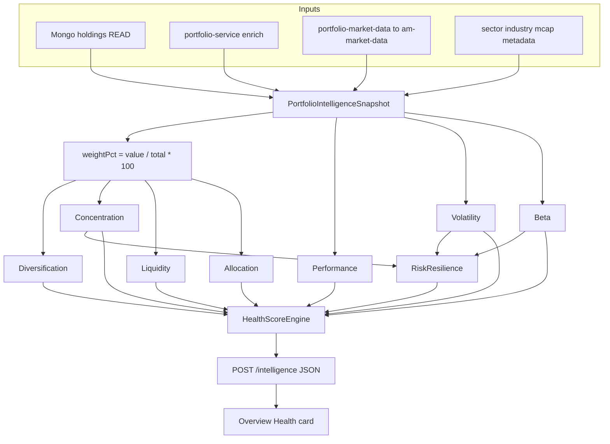
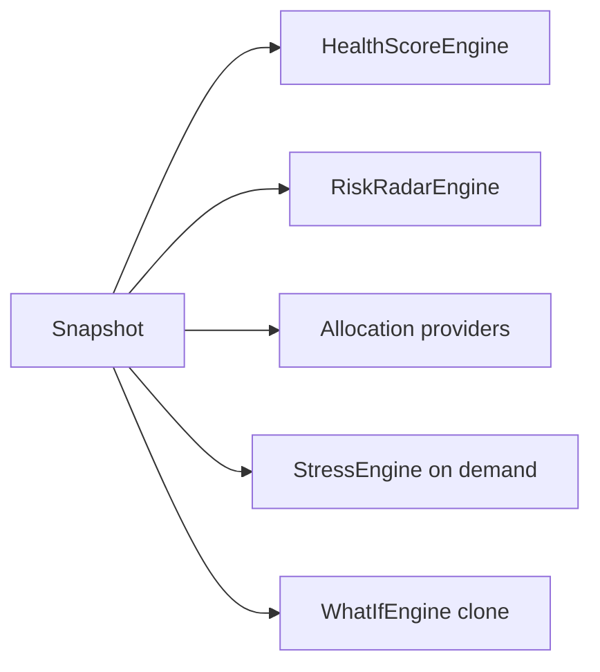

# E2E Backend Plan — Health & Intelligence Calculations

**Audience:** Backend / full-stack developers  
**Purpose:** Understand **every Health section**, what it means, and **exact backend math** (no “maybe”).  
**Related:** [plan.md](./plan.md) · [architecture.drawio](./architecture.drawio) (page 2) · [TODO.md](./TODO.md)

**Status:** MVP scoring constants locked in this file for implementation (`HealthScoreConstants`).  
**Engine home:** `am-portfolio` → `portfolio-analytics` → `HealthScoreEngine` (not built yet).  
**am-market:** NO CODE CHANGE — HTTP client only via `portfolio-market-data`.

---

## 0. Two kinds of numbers (read this first)

| Kind | Example | Meaning |
|------|---------|---------|
| **Money weight %** | Banking **35%** | `₹ in group ÷ total portfolio ₹ × 100` — real portfolio exposure |
| **Health component score** | Concentration **64** | Grade **0–100** for that theme — **not** “64% of portfolio” |
| **Mix weight** | Concentration × **0.20** | How much that grade counts in final Health |

```text
Holdings (qty × price)
        ↓
weight%  (money)          ← exact from ₹
        ↓
8 component scores 0–100  ← exact from formulas below
        ↓
Health = Σ (score × mixWeight)
        ↓
band + UI gauge
```

---

## 1. End-to-end backend flow



| Module | Role |
|--------|------|
| `portfolio-api` | `POST .../intelligence`, owner check |
| `portfolio-analytics` | Snapshot factory + `HealthScoreEngine` |
| `portfolio-service` | Reuse holdings / summary enrichment |
| `portfolio-market-data` | Prices, history, NIFTY (calls am-market-data) |
| Mongo | Holdings read only |
| UI | Renders DTO only — **no score invention** |

---

## 2. Snapshot foundation (exact)

For each holding:

```text
value_i     = price_i × quantity_i
totalValue  = Σ value_i
weightPct_i = round(value_i / totalValue * 100, 2)   // HALF_UP
```

Same rule for **15 or 150** stocks — always **money**, never “count of stocks = %”.

### Worked portfolio (₹10,00,000)

| Stock | Sector | Cap | Value | weightPct |
|-------|--------|-----|------:|----------:|
| HDFC Bank | Banking | Large | 2,50,000 | **25.00** |
| ICICI Bank | Banking | Large | 1,00,000 | **10.00** |
| TCS | IT | Large | 1,50,000 | **15.00** |
| Infosys | IT | Large | 50,000 | **5.00** |
| Reliance | Energy | Large | 2,00,000 | **20.00** |
| Mid A | Pharma | Mid | 1,00,000 | **10.00** |
| Small B | Pharma | Small | 1,00,000 | **10.00** |
| **Total** | | | **10,00,000** | **100.00** |

Derived:

```text
holdingsCount     = 7
distinctSectors   = 4   // Banking, IT, Energy, Pharma
top1Pct           = 25.00   // HDFC
maxSectorPct      = 35.00   // Banking = 25+10
liquidSharePct    = 85.00   // Large+Mid = 7,50,000+1,00,000
```

---

## 3. Final Health mix (exact)

| Component | Mix weight |
|-----------|------------|
| Diversification | 0.20 |
| Concentration | 0.20 |
| Performance | 0.15 |
| Volatility | 0.15 |
| Liquidity | 0.10 |
| Beta | 0.10 |
| Allocation | 0.05 |
| Risk Resilience | 0.05 |

```text
Health = round( Σ score_i × mixWeight_i )
```

**Bands (exact):**

| Band | Health |
|------|--------|
| Critical | 0–39 |
| Watch | 40–64 |
| Healthy | 65–84 |
| Strong | 85–100 |

**Amber “area to focus”:** component `score < 70`.

**Omit rule:** if `historyPoints < 20` → **omit Volatility and Beta**, then **renormalize** remaining mix weights so they sum to 1.0. Never invent vol/beta.

---

## 4. Every section — meaning + backend formula + example

### 4.1 Diversification — mix **20%**

**What it means (plain):** Is money spread across enough stocks and sectors?

**Backend inputs:** `holdingsCount`, `distinctSectors` from Snapshot.

**Exact formula:**

```text
nameScore   = min(100, holdingsCount * 8)
sectorScore = min(100, distinctSectors * 12)
divScore    = clamp(0.5 * nameScore + 0.5 * sectorScore, 0, 100)
```

**Example (7 names, 4 sectors):**

```text
nameScore   = min(100, 7*8)  = 56
sectorScore = min(100, 4*12) = 48
divScore    = 0.5*56 + 0.5*48 = 52
```

**If 70 names, 10 sectors:**

```text
nameScore   = min(100, 70*8) = 100
sectorScore = min(100, 10*12) = 100
divScore    = 100
```

> Note: Diversification does **not** look at ₹ peaks; Concentration does. A book can have high Div count but still fail Concentration.

---

### 4.2 Concentration — mix **20%**

**What it means:** Is too much money in one stock or one sector?

**Backend inputs:** `top1Pct`, `maxSectorPct`.

**Exact formula:**

```text
concScore = clamp(100 - 2*top1Pct - 1.5*max(0, maxSectorPct - 20), 0, 100)
```

**Risk chips (separate from score):** High if `top1Pct ≥ 25` OR `maxSectorPct ≥ 30`.

**Example:**

```text
top1Pct = 25, maxSectorPct = 35
concScore = 100 - 2*25 - 1.5*max(0, 35-20)
          = 100 - 50 - 1.5*15
          = 100 - 50 - 22.5
          = 27.5  → round/display as needed (engine: keep 1 decimal or round to int)
```

For UI integer scores use `round()`:

```text
concScoreInt = round(27.5) = 28
```

**If top1=5, sector=12:**

```text
concScore = 100 - 2*5 - 1.5*max(0, 12-20) = 100 - 10 - 0 = 90
```

---

### 4.3 Performance — mix **15%**

**What it means:** How did the portfolio return vs NIFTY over the Health window?

**Backend inputs:** `portRetPct`, `niftyRetPct` over window (MVP default: **last 60 trading days**; if Overview TF used later, still require ≥20 points).

**Exact formula:**

```text
perfScore = clamp(50 + 5*(portRetPct - niftyRetPct) + 2*portRetPct, 0, 100)
```

**Example:** port +8.7%, NIFTY +5%:

```text
perfScore = 50 + 5*(8.7-5) + 2*8.7
          = 50 + 5*3.7 + 17.4
          = 50 + 18.5 + 17.4
          = 85.9 → round 86
```

**If port −15%, NIFTY 0:**

```text
perfScore = 50 + 5*(-15-0) + 2*(-15) = 50 - 75 - 30 = -55 → clamp 0
```

---

### 4.4 Volatility — mix **15%**

**What it means:** How jumpy is the **total portfolio value** day to day?

**Backend steps (exact):**

```text
1. Load portfolio total value series V[0..n-1]  (history path; market client if needed)
2. For t = 1..n-1:
     r[t] = (V[t] - V[t-1]) / V[t-1]          // fraction, e.g. 0.02
3. dailyVolPct = stddev(r[]) * 100            // in percent points, e.g. 2.0 means 2%
4. volScore = clamp(100 - dailyVolPct * 800, 0, 100)
5. If n-1 < 20 returns → OMIT Volatility (do not invent)
```

`stddev` = population or sample: use **sample stddev** (n−1) in Java `Math`/commons — document in unit tests.

**Locked formula (use this in code):**

```text
dailyVolPct = stddev(r[]) * 100              // 0.70 means 0.70% per day
volScore    = clamp(100 - dailyVolPct * 40, 0, 100)
```

| dailyVolPct | volScore |
|-------------|----------|
| 0.25 | **90** |
| 0.70 | **72** |
| 1.00 | **60** |
| 2.50 | **0** |

**Example calm:** `dailyVolPct = 0.25` → `100 - 0.25*40 = 90`  
**Example bumpy:** `dailyVolPct = 0.70` → `100 - 0.70*40 = 72`

Use **sample** standard deviation in unit tests; require ≥20 daily returns or **OMIT**.

---

### 4.5 Liquidity — mix **10%**

**What it means:** How much of the book is in easier-to-exit names?

**Definition (locked):** Large + Mid = liquid.

```text
liquidSharePct = (sum value where cap in {LARGE, MID}) / totalValue * 100
liqScore       = clamp(liquidSharePct, 0, 100)
```

**Example:** liquid ₹8,50,000 / 10,00,000 → **85.00** → `liqScore = 85`

---

### 4.6 Beta — mix **10%**

**What it means:** How hard does the portfolio move when NIFTY moves?

**Backend:**

```text
r_p[t] = portfolio daily returns
r_m[t] = NIFTY daily returns (same dates)
beta   = cov(r_p, r_m) / var(r_m)
betaScore = clamp(100 - abs(beta - 1)*50 - max(0, beta - 1.3)*40, 0, 100)
```

**Risk chip High if `beta > 1.3`.**

**Example beta = 1.2:**

```text
betaScore = 100 - abs(1.2-1)*50 - max(0, 1.2-1.3)*40
          = 100 - 0.2*50 - 0
          = 100 - 10
          = 90
```

**Example beta = 1.5:**

```text
betaScore = 100 - abs(1.5-1)*50 - max(0, 1.5-1.3)*40
          = 100 - 25 - 8
          = 67
```

If NIFTY/history missing → **OMIT**.

---

### 4.7 Allocation — mix **5%**

**What it means:** How extreme is the X-Ray sector mix?

**Same % as X-Ray donut:** `maxSectorPct`.

```text
allocScore = clamp(100 - 1.2 * max(0, maxSectorPct - 25), 0, 100)
```

**Example Banking 35%:**

```text
allocScore = 100 - 1.2*(35-25) = 100 - 12 = 88
```

**If Banking 70%:**

```text
allocScore = 100 - 1.2*(70-25) = 100 - 54 = 46
```

---

### 4.8 Risk Resilience — mix **5%**

**What it means:** Blend of concentration + calmness (vol/beta).

```text
volPart  = volScore if present else 70
betaPart = betaScore if present else 70
resScore = clamp(0.5*concScore + 0.25*volPart + 0.25*betaPart, 0, 100)
```

**Example** with conc 28, vol 72, beta 90:

```text
resScore = 0.5*28 + 0.25*72 + 0.25*90
         = 14 + 18 + 22.5
         = 54.5 → round 55
```

---

## 5. Full worked Health (same portfolio + assumed series)

Assume after history/NIFTY we also have:

```text
divScore   = 52
concScore  = 28
perfScore  = 86
volScore   = 72
liqScore   = 85
betaScore  = 90
allocScore = 88
resScore   = round(0.5*28 + 0.25*72 + 0.25*90) = 55
```

```text
Health =
  52*0.20 + 28*0.20 + 86*0.15 + 72*0.15
+ 85*0.10 + 90*0.10 + 88*0.05 + 55*0.05
= 10.4 + 5.6 + 12.9 + 10.8 + 8.5 + 9.0 + 4.4 + 2.75
= 64.35 → round 64 → band Watch
```

Amber focus (`score < 70`): Diversification 52, Concentration 28, Resilience 55 → **3 areas**.

> Mock UI “78 / Healthy” was a **design sample**. Live score follows **these formulas** + real data. Golden unit tests must pin fixtures to expected integers.

---

## 6. Related engines (same Snapshot)



| Engine | API | Calc basis |
|--------|-----|------------|
| Health | part of `POST .../intelligence` | formulas above |
| Risk | same | riskiness axes; chips from top1/sector/beta thresholds |
| X-Ray | same | `groupValue/total*100` |
| Stress | `POST .../stress` | `Σ weightPct/100 * shockPct * betaProxy` |
| What-If | `POST .../what-if` | clone Snapshot → change → recompute weights + Health |

**Stress example:** NIFTY −10%, betaProxy=1, equal shock on all:

```text
deltaPct ≈ -10
deltaInr ≈ -10% * totalValue
```

Sector shock Banking −20%: only Banking weights get −20%.

---

## 7. How UI connects (no UI math)

| Widget | Calls | Shows |
|--------|-------|-------|
| Health gauge + 8 rows | `health.score`, `health.band`, `health.components[]` | Backend grades |
| Risk | `risk.axes`, `risk.findings[]` | Backend |
| X-Ray donut | `xray.sectorWeights` etc. | Backend money % |
| Stress table | stress API on Run | Estimates |
| What-If table | what-if API on Simulate | Before/after |

Flutter **must not** recompute Health locally.

---

## 8. PROD accuracy loop (make backend perfect)

```text
1. Golden fixture unit tests (known Snapshot → exact scores)
2. Local: JAVA_HOME=JBR → mvn clean install -DskipTests (or run engine tests)
3. User confirms deploy
4. am-portfolio\deploy-prod.ps1
5. Postman/curl PROD POST .../intelligence
6. Assert: weightPct ±0.5pp vs advanced allocation; health within ±1 of fixture replay
7. If wrong → Loki/kubectl → fix formula/data → rebuild → redeploy → repeat
8. Only then UI binds fields
```

---

## 9. Implementation checklist (developer)

- [ ] `PortfolioIntelligenceSnapshotFactory`
- [ ] `HealthScoreConstants` (all formulas in this file)
- [ ] `HealthScoreEngine` + golden tests (this worked example + edge: omit vol/beta)
- [ ] `RiskRadarEngine`, X-Ray reuse, Stress, What-If
- [ ] Controller owner assert
- [ ] OpenAPI DTOs
- [ ] PROD loop per [TODO.md](./TODO.md) P2+

---

## 10. Quick reference card

```text
weightPct_i = value_i / total * 100

div   = 0.5*min(100,n*8) + 0.5*min(100,s*12)
conc  = clamp(100 - 2*top1 - 1.5*max(0, maxSec-20), 0, 100)
perf  = clamp(50 + 5*(p-n) + 2*p, 0, 100)
vol   = clamp(100 - dailyVolPct*40, 0, 100)      // omit if <20 returns
liq   = clamp(liquidSharePct, 0, 100)            // Large+Mid
beta  = clamp(100 - |b-1|*50 - max(0,b-1.3)*40, 0, 100)
alloc = clamp(100 - 1.2*max(0, maxSec-25), 0, 100)
res   = 0.5*conc + 0.25*volOr70 + 0.25*betaOr70

Health = round(div*0.2 + conc*0.2 + perf*0.15 + vol*0.15
             + liq*0.1 + beta*0.1 + alloc*0.05 + res*0.05)
```

---

**Diagrams.net:** also see [architecture.drawio](./architecture.drawio) tab **“2. Health Components — % Logic”** for module wiring. This file is the **calculation SoT** for scores.
