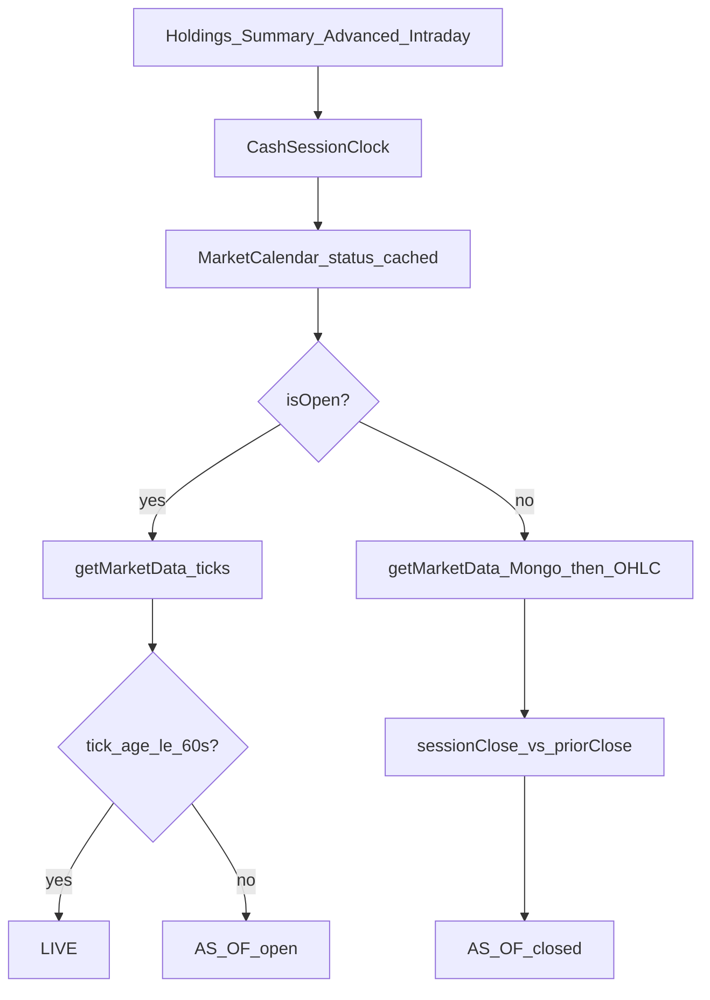

# Final plan (10/10) — Portfolio session pricing

## Rating of prior plan in this folder

| Version | Score | Why |
|---------|-------|-----|
| Prior A0–A5 draft | **7/10** | Correct portfolio-only scope + calendar APIs + Phase D, but missed summary reprice, intraday holiday gate, calendar latency budget, full API contracts |
| **This plan** | **10/10** | Per-API flows, summary coherence, intraday calendar gate, ≤200ms calendar fail-closed, contracts, Postman MCP loop |

API flow evidence: [Audit portfolio API flows](9c3bd2e7-77b4-4f26-a137-aba8e42d7a41).

---

## Scope (locked)

- **Repos:** am-portfolio + am-modern-ui only
- **Do not** change am-market code
- **Consume:** `GET /v1/market-calendar/status`, `GET /v1/market-calendar/timings`, existing OHLC/historical
- **No** Kafka offset seeking on read
- **BasketPriceResolver** quality flags: out of scope (basket-only today)

---

## Per-API target flow

| API | Path | Fix required |
|-----|------|--------------|
| Holdings | `GET /v1/portfolios/holdings` | Clock + stampFreshness + `sessionDate`; keep overlay reprice |
| Summary | `GET /v1/portfolios/summary` | **Reprice on cache hit** like holdings; freshness + `sessionDate` on summary meta |
| Advanced | `POST /v1/analytics/portfolio/{id}/advanced` | Prefetch under clock; movers last-session % when closed; attached summary same freshness |
| Movers | via advanced only | No new endpoint |
| Intraday | `GET /v1/portfolios/intraday`, `.../{id}/intraday` | Gate on `CashSessionClock` (not weekday-only) |
| History | `GET /v1/portfolios/history` | Holiday-aware last session when used for day window |
| Calendar dep | market-data `/v1/market-calendar/status` | Read-only; Phase D asserts |

Shared stack: `MarketDataService.getMarketData` L1 → Redis → Mongo → OHLC.

---

## Gaps closed by this plan

1. No calendar client → `MarketCalendarClient` (≤200ms timeout, 60s cache, fail-closed)
2. Three local Mon–Fri clocks → single `CashSessionClock` (holdings, Redis TTL, Kafka consumer, **intraday**)
3. `asOf = now` / false LIVE → tick-age + calendar
4. Closed day % ≈ 0 / sparse movers → session close vs **prior** close
5. Summary stale on cache hit → reprice like holdings overlay
6. UI As-of time-only / ungated 1D poll → sessionDate + MarketStreamingGate
7. Missing contracts → [API-CONTRACTS.md](./API-CONTRACTS.md)

---

## Implementation phases

See [PHASED-IMPLEMENTATION.md](./PHASED-IMPLEMENTATION.md). Order: P0 → P1 clock → P2 freshness → P3 closed pricing → P4 summary/advanced → **D deploy + Postman MCP loop** → U UI → X exit.

---

## Exit

Golden Zerodha `f969745c-f492-4b86-88ed-6588e9f28bb3`: non-market day shows last-session prices and day moves with `AS_OF`; next cash open shows `LIVE` only with fresh ticks; Phase D latency gates met.
