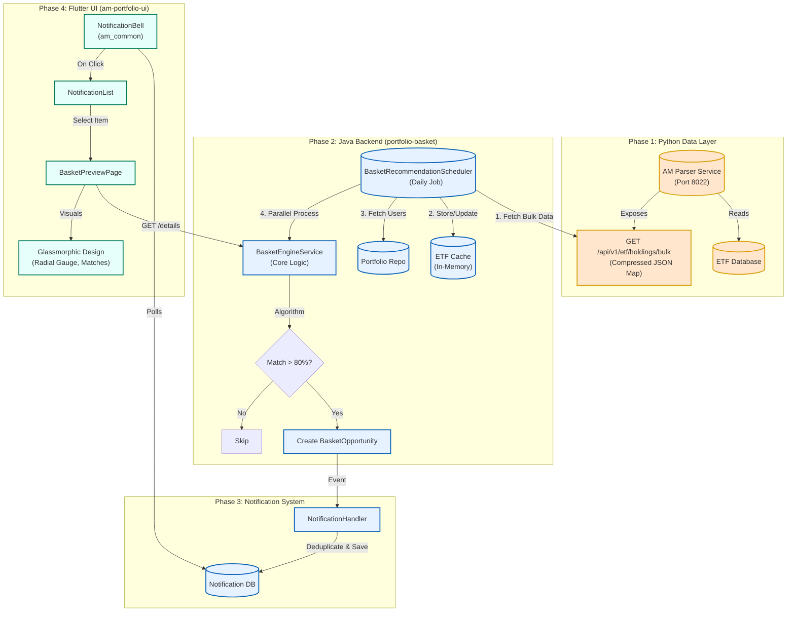

```mermaid
graph TD
    subgraph "Phase 1: Python Data Layer"
        P_API[("AM Parser Service
        (Port 8022)")]
        P_Bulk["GET /api/v1/etf/holdings/bulk
        (Compressed JSON Map)"]
        P_DB[(ETF Database)]
        
        P_API -->|Reads| P_DB
        P_API -->|Exposes| P_Bulk
    end

    subgraph "Phase 2: Java Backend (portfolio-basket)"
        J_Sched[("BasketRecommendationScheduler
        (Daily Job)")]
        J_Engine["BasketEngineService
        (Core Logic)"]
        J_Cache[("ETF Cache
        (In-Memory)")]
        J_Repo[(Portfolio Repo)]
        
        J_Sched -->|1. Fetch Bulk Data| P_Bulk
        J_Sched -->|2. Store/Update| J_Cache
        J_Sched -->|3. Fetch Users| J_Repo
        
        J_Sched -->|4. Parallel Process| J_Engine
        J_Engine -->|Algorithm| Logic{Match > 80%?}
        
        Logic -->|Yes| Opp[Create BasketOpportunity]
        Logic -->|No| Skip[Skip]
    end

    subgraph "Phase 3: Notification System"
        N_Handler["NotificationHandler"]
        N_DB[(Notification DB)]
        
        Opp -->|Event| N_Handler
        N_Handler -->|Deduplicate & Save| N_DB
    end

    subgraph "Phase 4: Flutter UI (am-portfolio-ui)"
        UI_Bell["NotificationBell
        (am_common)"]
        UI_List["NotificationList"]
        UI_Page["BasketPreviewPage"]
        
        UI_Bell -->|Polls| N_DB
        UI_Bell -->|On Click| UI_List
        UI_List -->|Select Item| UI_Page
        
        UI_Page -->|GET /details| J_Engine
        
        UI_Page -->|Visuals| Glass["Glassmorphic Design
        (Radial Gauge, Matches)"]
    end

    classDef python fill:#ffe6cc,stroke:#d79b00,stroke-width:2px;
    classDef java fill:#e6f2ff,stroke:#005bb7,stroke-width:2px;
    classDef ui fill:#e6fffa,stroke:#007a5e,stroke-width:2px;
    
    class P_API,P_Bulk,P_DB python;
    class J_Sched,J_Engine,J_Cache,J_Repo,Opp,N_Handler,N_DB java;
    class UI_Bell,UI_List,UI_Page,Glass ui;
```
