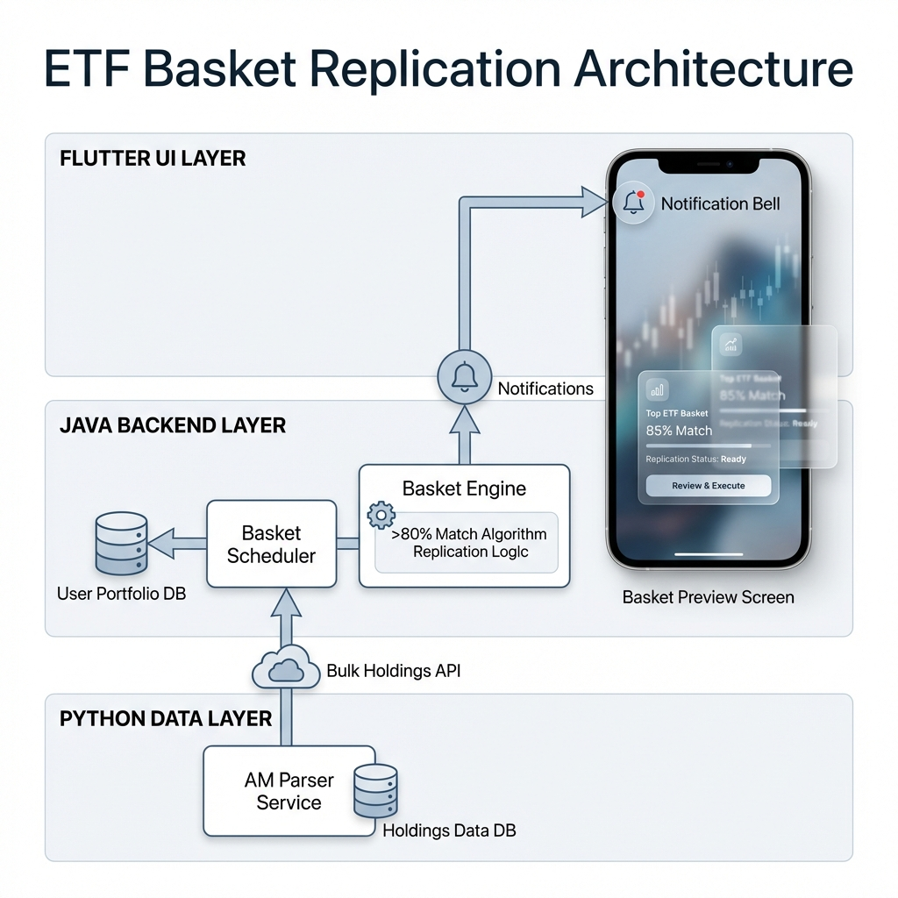

# Feature Specification: Smart Investment Basket Replication

**Version:** 1.0
**Status:** Approved for Development
**Owner:** AM Portfolio Team

---

## 1. Executive Summary
The **Smart Investment Basket** feature allows users to replicate high-performing ETFs or Mutual Funds using their existing stock holdings. The system proactively analyzes the user's portfolio, identifies overlaps (>80%), and suggests "Baskets" they can easily complete. This document serves as the guide for **UI Designers** and **Backend Engineers**.



---

## 2. Backend Requirements (For Engineering Team)

### 2.1 Core Logic & Architecture
*   **Module**: `portfolio-basket` (Java)
*   **Dependency**: `am-parser-service` (Python) for ETF Data.
*   **Primary Logic**:
    *   **Direct Match**: User holds exact ISIN.
    *   **Sector Substitute**: User holds a different stock in the *SAME* sector.
    *   **Threshold**: Only recommend if `(Direct + Substitutes) / Total ETF Items >= 80%`.

### 2.2 API Contracts

#### A. Bulk Data Ingestion (Internal)
*   **Endpoint**: `GET http://am-parser-service:8022/api/v1/etf/holdings/bulk`
*   **Response**: Compressed map of all ETF holdings.
    ```json
    {
      "IN002020202": { "symbol": "NIFTYBEES", "holdings": [{ "isin": "...", "sector": "Finance" }] }
    }
    ```

#### B. Basket Recommendations (Client Facing)
*   **Endpoint**: `GET /api/v1/basket/opportunities`
*   **Response (List)**:
    ```json
    [
      {
        "etfId": "INF20220202",
        "etfName": "Nifty IT ETF",
        "matchPercentage": 87.5,
        "missingStockCount": 2,
        "status": "READY_TO_BUILD"
      }
    ]
    ```

#### C. Basket Detail & Preview (Client Facing)
*   **Endpoint**: `POST /api/v1/basket/preview`
*   **Payload**: `{ "etfId": "..." }`
*   **Response**:
    ```json
    {
      "etfName": "Nifty IT ETF",
      "overallMatch": 87.5,
      "composition": [
        { "stock": "TCS", "status": "HELD", "userHolding": "TCS" },
        { "stock": "Infosys", "status": "MISSING", "userHolding": null },
        { "stock": "Wipro", "status": "SUBSTITUTE", "userHolding": "HCL Tech", "reason": "IT Sector Match" }
      ]
    }
    ```

---

## 3. Frontend / UI Requirements (For Design Team)

### 3.1 Design Language
*   **Theme**: `Glassmorphism` (Premium, Translucent, Blur).
*   **Library**: `am_design_system` (Flutter).
*   **Colors**:
    *   **Match/Held**: Emerald Green Gradient.
    *   **Missing**: Burnt Orange / Amber.
    *   **Substitute**: Royal Blue / Indigo.

### 3.2 Notification System
*   **Component**: `NotificationBell` (AppBar).
*   **Behavior**:
    *   Shows a **Red Badge** with count.
    *   **Dropdown/Modal**: Glassmorphic list of alerts.
    *   **Item**: "🚀 **Inventory Match!** You hold 85% of *Nifty 50*. Click to view."

### 3.3 Screen: Basket Preview Page
This is the main landing page when a user clicks a notification.

#### **Section A: The Hero Card (Top 40%)**
*   **Visual**: A large, sleek card with `BackdropFilter` logging blur (10px).
*   **Content**:
    *   **Radial Gauge**: Animated circle filling up to the Match % (e.g., 85%).
    *   **Title**: ETF Name (e.g., "Nifty Alpha 50").
    *   **Subtitle**: "You are 5 stocks away from replicating this basket."
*   **Animation**:
    *   Gauge should animate from 0% -> 85% on load (EaseOutCubic).
    *   Card should slide in from top (`SlideTransition`).

#### **Section B: Composition Breakdown (Bottom 60%)**
*   **Layout**: Tabbed View or Split View.
    *   **Tab 1: Your Match (The "Good" Stuff)**
        *   List of stocks the user OWNS.
        *   **Icon**: Green Checkmark (`Icons.check_circle`).
        *   **Styling**: White text, high opacity.
    *   **Tab 2: Missing / Substitutes (The "Gap")**
        *   **Missing Items**:
            *   **Icon**: Orange Add (`Icons.add_circle_outline`).
            *   **Text**: "Infosys (Required)".
        *   **Substitutes (The "Smart" Feature)**:
            *   **Visual**: A "Swap" card logic.
            *   **Layout**: Row showing `[User's Stock]` ➡️ `[ETF's Required Stock]`.
            *   **Icon**: Swap Arrows (`Icons.swap_horiz`).
            *   **Label**: "Using HCL Tech as Sector Proxy".

### 3.4 Micro-Interactions
1.  **Entry**: "Staggered List Animation" for the stock items (items fly in one by one).
2.  **Scroll**: Parallax effect on the Hero Card as user scrolls down the list.
3.  **Click**: Tapping a stock opens a `BottomModal` with deep fundamental details.

---

## 4. Acceptance Criteria
1.  **Accuracy**: A user with 8 stocks matching a 10-stock ETF MUST see "80%" match.
2.  **Sector Logic**: If I hold *ICICI Bank* and the ETF needs *HDFC Bank*, the system MUST suggest it as a "Sector Substitute" (Finance) if configured.
3.  **Performance**: The "Preview" page must load in < 1.5 seconds.
4.  **Visuals**: The UI must look "Glassy" and premium, not flat.
