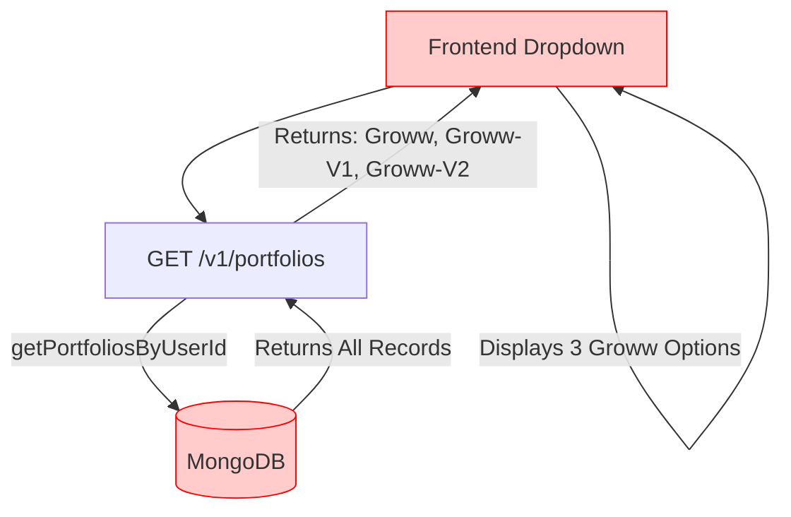
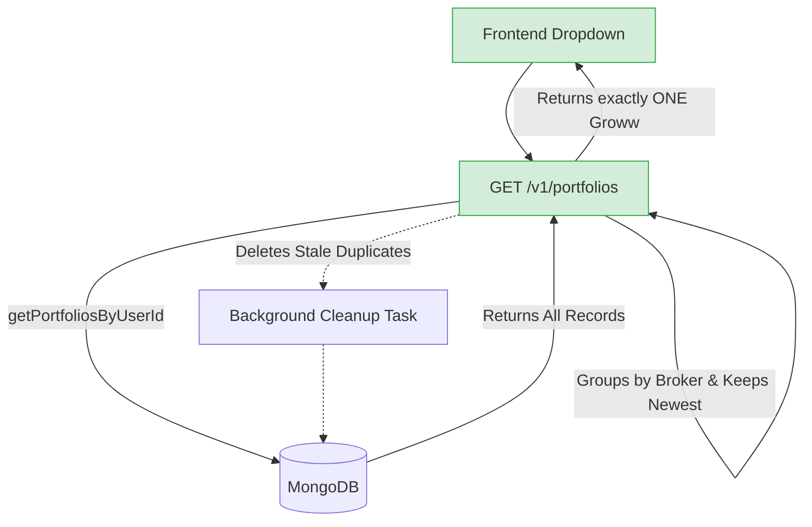
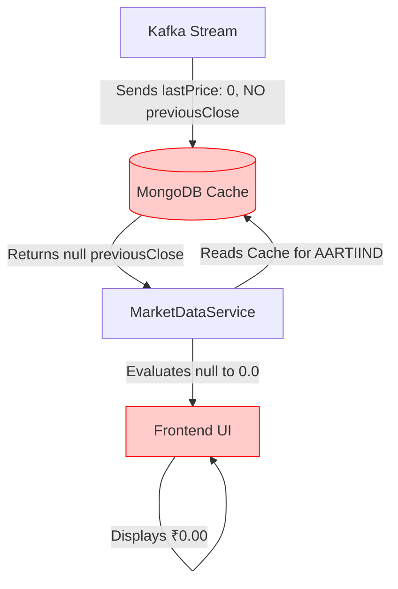
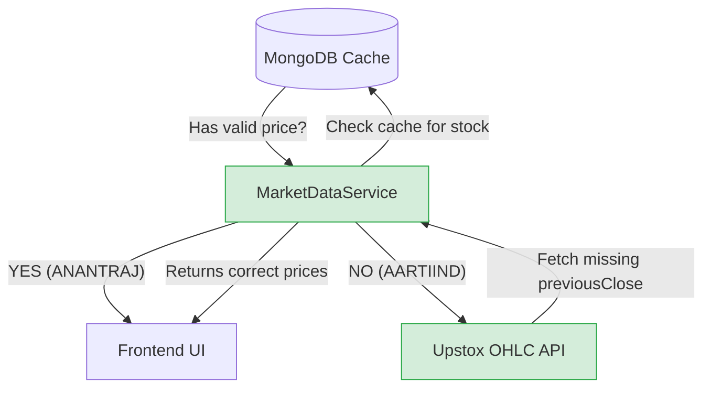

# Version 1 Axrax Document: Feature Improvement & Bug Fixes

## 1. Multiple Portfolios for the Same Broker (e.g., "Groww" duplication)

### What is Broken
Historically, when updating portfolios, the backend sometimes created duplicates (e.g., `Groww-V1`, `Groww-V2`) instead of updating the existing one. Although the database creation logic was later improved, the API endpoint that fetches portfolios for the UI (`getPortfoliosByUserId`) was **never updated to filter these old duplicates out**. Because of this, the frontend receives multiple Groww portfolios and displays all of them in the dropdown.

### What We Will Fix
We will update `getPortfoliosByUserId` to automatically deduplicate the list on-the-fly. It will group portfolios by their `BrokerType` and return only the **latest, canonical portfolio**. Additionally, it will trigger an asynchronous background task to permanently delete the stale duplicates from the database.

---

## 2. Live Prices showing ₹0.00 (The Kafka Bug)

### What is Broken
When analyzing the Kafka data stored in MongoDB (`stock_prices_cache`), we found that for some inactive stocks and ETFs (like `AARTIIND`), the upstream python scraper only sends `lastPrice: 0` and **completely omits** `previousClose` and `openPrice`.

Previously, if `openPrice` was missing, the backend rejected the cache and fell back to the blazing-fast Upstox API. However, in our attempt to fix this earlier, we removed the strict `openPrice` check. Because `previousClose` is `null` in the database, the backend ended up returning `0.0`, breaking the UI.

### What We Will Fix
We will update `MarketDataService.java` to act intelligently. If the MongoDB cache doesn't contain a valid `lastPrice`, `previousClose`, OR `openPrice`, it will immediately mark the cache as "incomplete". 
- Active stocks (like `ANANTRAJ`) will load instantly from Kafka (50ms).
- Broken/inactive stocks (like `AARTIIND`) will safely bypass the incomplete cache and fetch their data directly from the Upstox API.

